# kbot

# 🤖 Telegram Bot (kbot) - Complete CI/CD Pipeline

## Architecture Overview

This project implements a complete CI/CD pipeline for a Telegram bot using modern DevOps practices:

- **CI/CD**: GitHub Actions
- **Container Registry**: GitHub Container Registry (ghcr.io)
- **Deployment**: ArgoCD + Kubernetes
- **Infrastructure**: Kubernetes
- **Trigger**: Push to `develop` branch

## 🔄 CI/CD Workflow

```mermaid
graph TD
    A[🧑‍💻 Developer Push to develop] --> B[🔧 GitHub Actions Triggered]
    B --> C[✅ CI: Run Tests & Lint]
    C --> D[🔨 CI: Build Go Application]
    D --> E[🐳 CI: Build Docker Image]
    E --> F[📦 CI: Push to ghcr.io]
    F --> G[📝 CD: Update Helm Chart]
    G --> H[💾 CD: Commit Version Update]
    H --> I[👁️ ArgoCD Detects Changes]
    I --> J[🔄 ArgoCD Sync Application]
    J --> K[🚀 Deploy to Kubernetes]
    K --> L[🤖 Telegram Bot Running]

    M[📊 ArgoCD Dashboard] --> I
    N[☸️ Kubernetes Cluster] --> K
    O[📦 GitHub Container Registry] --> F
```



## Overview

**kbot** is a Telegram bot written in Go that can be built and run on multiple platforms, including Linux, macOS, and Windows, on both `amd64` and `arm64` architectures. The project uses a `Makefile` for build automation and a `Dockerfile` for containerization.

## Requirements

-   Go 1.17+
-   Docker
-   Git
-   Make

## Quick Start

### Clone the repository

```bash
git clone https://github.com/tenariaz/kbot.git
cd kbot
```

### Build for your current platform

```bash
make build
```

### Run the program

```bash
./kbot
```

## Cross-Compilation

### Build for different platforms

```bash
# For Linux AMD64
make linux

# For Linux ARM64
make linux-arm

# For macOS AMD64
make darwin

# For macOS ARM64
make darwin-arm

# For Windows AMD64
make windows
```

## Docker

### Build a Docker image

```bash
# For the current platform
make image

# For Linux
make image-linux

# For Linux arm64
make image-inux-arm64

# For macOS arm64
make image-darwin-arm64

# For Windows
make image-windows-amd64
```


### Run tests in Docker


```bash
docker build --target test .
```

### Push Docker image

```bash
make push
```

### Run the program from Docker

```bash
docker run --rm ghcr.io/tenariaz/kbot:$(VERSION)-$(TARGETOS)-$(TARGETARCH)
```

## Testing
```bash
make test
```

## Cleaning up

```bash
make clean
```

## Project Structure

-   `cmd/` - Application commands
-   `pkg/` - Library packages
-   `Makefile` - Task automation
-   `Dockerfile` - Containerization

## Features

-   Cross-compilation for multiple platforms (Linux, macOS, Windows)
-   Support for both AMD64 and ARM64 architectures
-   Docker containers supporting multiple platforms without using buildx
-   Automated build and testing
-   Integrated with GitHub Container Registry

## License

MIT
